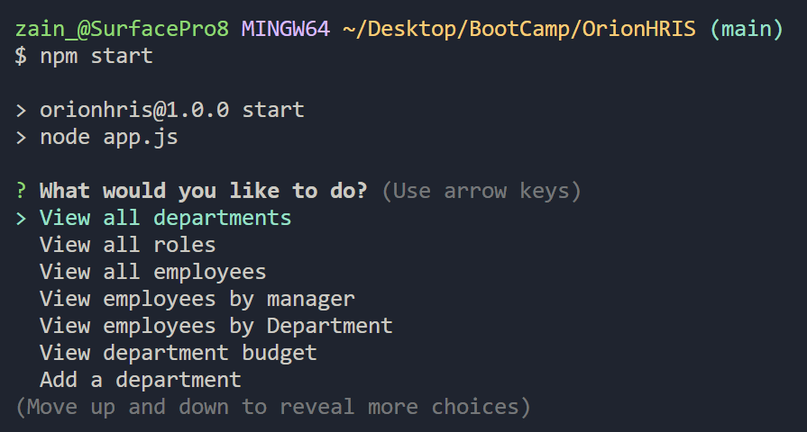

# OrionHRIS
A console based employee management software for corporations

## Description

This is a command-line application for managing a company's employee database. It allows users to view, add, update, and delete departments, roles, and employees.

## Features

- View all departments, roles, and employees
- View employees by manager or department
- View department budgets
- Add departments, roles, and employees
- Update employee roles and managers
- Search for employees
- Delete departments, roles, and employees

## Technologies Used

- Node.js
- PostgreSQL
- Inquirer.js

## Installation

1. Clone the repository
2. Install dependencies:
```
    npm i
```
3. Set up your PostgreSQL database and update the connection details in `lib/queries.js`

## Usage

Run the application using:
```
    npm start
```
Follow the on-screen prompts to navigate through the application and manage your employee database.

## Screenshots



## Contributing

Contributions are welcome. Please open an issue or submit a pull request for any improvements.

## License

[MIT License](LICENSE)

## Repository Link

[OrionHRIS](https://github.com/zainabid333/OrionHRIS)

## Walkthrough Video Link
[Walkthrough Vidio](https://drive.google.com/file/d/1CkX41KlNd0nYkdVmnH5twJLWBMq5fk5g/view)
